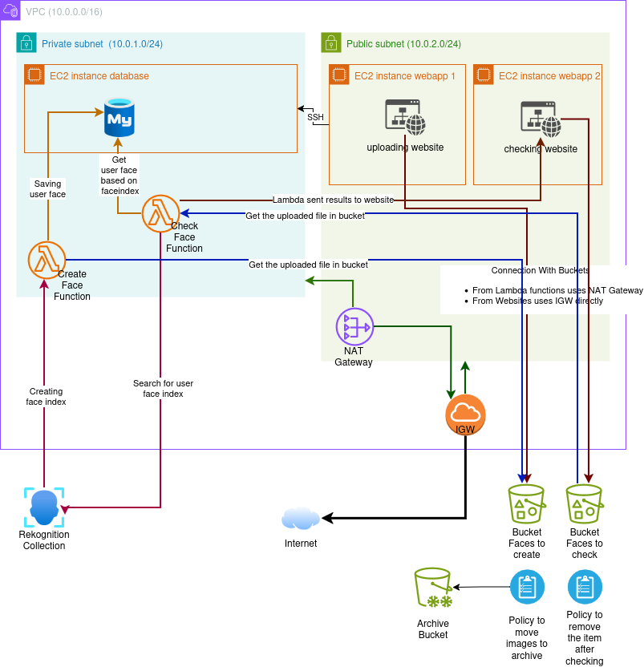

# 🧠 AWS Face Rekognition – Full Architecture & Workflow

This repository contains the source code and infrastructure layout for an **AWS Face Rekognition Application** that allows users to:

- Upload a face image  
- Create a face index for later recognition  
- Search for a face in the database  
- Receive real-time recognition results through WebSockets  

The solution leverages **AWS EC2, Lambda, Rekognition, S3, NAT Gateway, IGW, and MySQL**.

---

## 📌 Architecture Diagram



---

# 🚀 Architecture Overview

The entire system is deployed inside a dedicated **VPC (10.0.0.0/16)** that contains:

- Private Subnet (10.0.1.0/24)
- Public Subnet (10.0.2.0/24)
- NAT Gateway for Lambda
- Internet Gateway for EC2 public access

---

## 🔵 Private Subnet (10.0.1.0/24)

### ## EC2 – Database Instance
- Runs **MySQL**
- Stores indexed user information (user_id, face_id, metadata)
- Only accessible by Lambda

### ## Lambda Functions (Python 3.11)
Both Lambda functions run in **Python 3.11** and access S3 using the NAT Gateway.

### 🔸 CreateFaceFunction
- Triggered when a new image is uploaded to S3
- Uses **AWS Rekognition** to create a face index
- Stores the face match data in MySQL
- Saves processed/indexed images to S3

### 🔸 CheckFaceFunction
- Triggered when a face search request is uploaded
- Uses Rekognition `SearchFacesByImage`
- Fetches matching user information from MySQL
- Sends response back to the website (via Node.js + Socket.io)

---

## 🟧 Public Subnet (10.0.2.0/24)

### ## EC2 Webapp 1 – Uploading Website
- Built using **PHP + Nginx**
- Uses a `.env` file for:
  - S3 bucket name
  - AWS region
  - Access keys
- Uploads user images to S3 (Upload Bucket)
- Triggers Lambda CreateFaceFunction

### ## EC2 Webapp 2 – Searching Website
- Frontend: **index.html**
- Backend: **Node.js**
- Uses **Socket.io** for real-time face search results
- Uploads face images to S3 (Search Bucket)
- Triggers Lambda CheckFaceFunction

💡 **Both EC2 instances connect to S3 directly through the Internet Gateway (IGW).**

---

# ☁️ Storage Layer – S3 Buckets

### 🟢 Upload Bucket
- Stores the raw uploaded user images  
- Triggers CreateFaceFunction

### 🟢 Search Bucket
- Stores uploaded images for face searching  
- Triggers CheckFaceFunction

### 🟢 Indexed Faces Bucket
- Stores processed and recognized faces  
- Used by Lambda functions

---

# 🌐 Network Layer

### **Internet Gateway (IGW)**
Used by the two EC2 web applications to communicate directly with S3 and the internet.

### **NAT Gateway**
Used by the Lambda functions in the private subnet to securely access:
- S3 buckets  
- Rekognition  
- The database on private EC2

---

# 🧩 System Workflow

## 1️⃣ Create Face Index (User Registration)
1. User uploads image via **PHP Upload Website**
2. File is saved to **S3 Upload Bucket**
3. S3 triggers **CreateFaceFunction**
4. Lambda sends image to **AWS Rekognition**
5. Rekognition generates face ID
6. Lambda stores metadata in **MySQL**
7. Indexed face is saved to S3
8. Website receives confirmation

---

## 2️⃣ Search for a Face (User Lookup)
1. User uploads image via **Node.js Search Website**
2. File stored in **S3 Search Bucket**
3. S3 triggers **CheckFaceFunction**
4. Lambda sends image to Rekognition for searching
5. Rekognition returns similarity score + face match
6. Lambda fetches user details from MySQL
7. Lambda sends results to Node.js server
8. Node.js broadcasts to client through **Socket.io**
9. User sees instant result

---

# 🛠️ Technologies Used

### Backend
- AWS Lambda (Python 3.11)
- AWS Rekognition
- Node.js + Socket.io (real-time search)
- PHP 8 + Nginx (upload website)
- MySQL database running on EC2

### AWS Services
- EC2
- Lambda
- S3
- Rekognition
- NAT Gateway
- Internet Gateway
- VPC + Subnets

---

# 📁 Project Structure
## 📁 Project Structure

```bash
├── upload-website
│   ├── index.php
│   ├── .env
│   ├── nginx.conf
│
├── search-website
│   ├── index.html
│   ├── server.js
│   ├── socket.js
│
├── lambda-create-face
│   ├── handler.py
│   └── requirements.txt
│
├── lambda-check-face
│   ├── handler.py
│   └── requirements.txt
│
├── database
│   ├── init.sql
│   └── schema.png
│
├── docs
│   ├── architecture-diagram.png
│   └── README-assets.md
│
└── README.md
```

---

# ▶️ Deployment Steps

### 1. Create VPC + Subnets
- Public + Private subnet
- Add Internet Gateway
- Add NAT Gateway

### 2. Deploy EC2 Instances
- Install PHP/Nginx (upload app)
- Install Node.js + Socket.io (search app)

### 3. Create S3 Buckets
- upload-bucket  
- search-bucket  
- indexed-bucket  

### 4. Deploy Lambda Functions
- Python 3.11 runtime
- Add IAM permissions (S3, Rekognition, MySQL access)

### 5. Configure Security Groups
- Allow EC2 ↔ S3
- Allow Lambda ↔ MySQL

---

# 📌 Future Improvements
- Add API Gateway for serverless APIs  
- Add Amazon RDS instead of EC2 MySQL  
- Add CloudFront for CDN  
- Add Cognito authentication  

---

If you want, I can also generate:
- A **badge header** (AWS, PHP, Node.js, Python)  
- A **Setup & installation guide**  
- A **Terraform / CloudFormation version** of the architecture  

